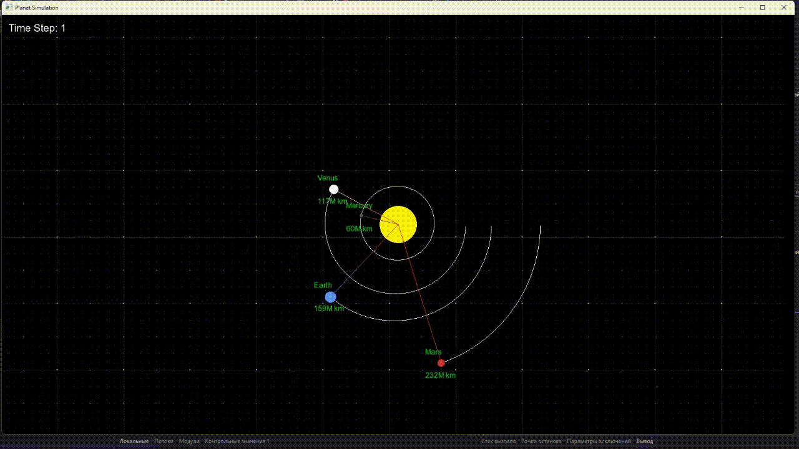

<h1 align='center'>Solar System in C++ SFML</h1>

 

I have created a solar system that matches physical properties of the universe as close to reality as possible. I have taken into account <b>Newton's Law of Universal Gravitation</b>. 

$$ \large F = G\frac {M_1M_2} {r^2} $$

Since my program wasn't working correctly once, I've noticed that I've lost Eccentricity. Simply said, it's a value that can make an ellipse from circumference of a circle. That insight gave me more accurate result.

<h3>Demo</h3>

